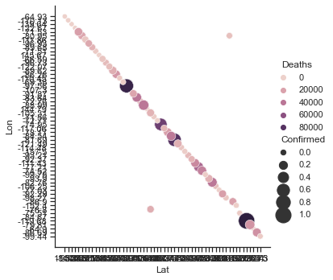
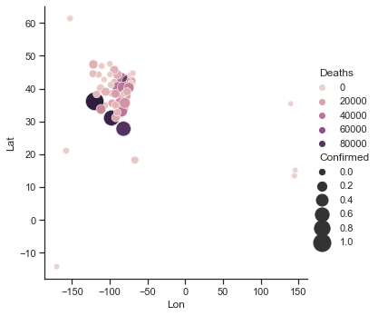
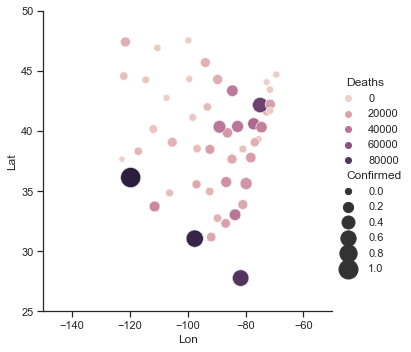
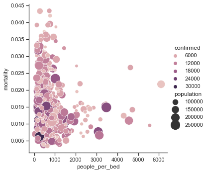

```python
import requests
import pandas as pd
import json
import numpy as np
req=requests.get("https://api.covid19api.com/live/country/united-states").json()
covid=pd.DataFrame(req)
```


```python
covid
```


<div>
<style scoped>
    .dataframe tbody tr th:only-of-type {
        vertical-align: middle;
    }

    .dataframe tbody tr th {
        vertical-align: top;
    }

    .dataframe thead th {
        text-align: right;
    }
</style>
<table border="1" class="dataframe">
  <thead>
    <tr style="text-align: right;">
      <th></th>
      <th>ID</th>
      <th>Country</th>
      <th>CountryCode</th>
      <th>Province</th>
      <th>City</th>
      <th>CityCode</th>
      <th>Lat</th>
      <th>Lon</th>
      <th>Confirmed</th>
      <th>Deaths</th>
      <th>Recovered</th>
      <th>Active</th>
      <th>Date</th>
    </tr>
  </thead>
  <tbody>
    <tr>
      <th>0</th>
      <td>9cb646d4-fb86-4b74-8c16-df1f8d0bedaf</td>
      <td>United States of America</td>
      <td>US</td>
      <td>United States Virgin Islands</td>
      <td></td>
      <td></td>
      <td>18.35</td>
      <td>-64.93</td>
      <td>0</td>
      <td>0</td>
      <td>0</td>
      <td>0</td>
      <td>1970-01-01T00:00:00Z</td>
    </tr>
    <tr>
      <th>1</th>
      <td>f27bd486-5cf5-4424-ae99-45b123578efd</td>
      <td>United States of America</td>
      <td>US</td>
      <td>American Samoa</td>
      <td></td>
      <td></td>
      <td>-14.27</td>
      <td>-170.13</td>
      <td>0</td>
      <td>0</td>
      <td>0</td>
      <td>0</td>
      <td>1970-01-01T00:00:00Z</td>
    </tr>
    <tr>
      <th>2</th>
      <td>1b5a049b-59b6-474a-a4b3-290ff563da2b</td>
      <td>United States of America</td>
      <td>US</td>
      <td>Diamond Princess</td>
      <td></td>
      <td></td>
      <td>35.44</td>
      <td>139.64</td>
      <td>49</td>
      <td>0</td>
      <td>0</td>
      <td>49</td>
      <td>2020-08-04T00:00:00Z</td>
    </tr>
    <tr>
      <th>3</th>
      <td>d3458b9a-8446-4760-89ab-7367195b6c8e</td>
      <td>United States of America</td>
      <td>US</td>
      <td>Grand Princess</td>
      <td></td>
      <td></td>
      <td>37.65</td>
      <td>-122.67</td>
      <td>103</td>
      <td>3</td>
      <td>0</td>
      <td>100</td>
      <td>2020-08-04T00:00:00Z</td>
    </tr>
    <tr>
      <th>4</th>
      <td>03329e68-7b08-413e-8a83-d7a5baa6537d</td>
      <td>United States of America</td>
      <td>US</td>
      <td>Massachusetts</td>
      <td></td>
      <td></td>
      <td>42.23</td>
      <td>-71.53</td>
      <td>709622</td>
      <td>17984</td>
      <td>0</td>
      <td>691638</td>
      <td>2021-06-25T00:00:00Z</td>
    </tr>
    <tr>
      <th>...</th>
      <td>...</td>
      <td>...</td>
      <td>...</td>
      <td>...</td>
      <td>...</td>
      <td>...</td>
      <td>...</td>
      <td>...</td>
      <td>...</td>
      <td>...</td>
      <td>...</td>
      <td>...</td>
      <td>...</td>
    </tr>
    <tr>
      <th>24475</th>
      <td>f00b33c7-1750-4896-a658-ad5bd0d0b232</td>
      <td>United States of America</td>
      <td>US</td>
      <td>Puerto Rico</td>
      <td></td>
      <td></td>
      <td>18.22</td>
      <td>-66.59</td>
      <td>938654</td>
      <td>5033</td>
      <td>0</td>
      <td>933621</td>
      <td>2022-09-11T00:00:00Z</td>
    </tr>
    <tr>
      <th>24476</th>
      <td>f7613d55-b257-43ce-b992-16226af3f9e0</td>
      <td>United States of America</td>
      <td>US</td>
      <td>Oklahoma</td>
      <td></td>
      <td></td>
      <td>35.57</td>
      <td>-96.93</td>
      <td>1182071</td>
      <td>16759</td>
      <td>0</td>
      <td>1165312</td>
      <td>2022-09-11T00:00:00Z</td>
    </tr>
    <tr>
      <th>24477</th>
      <td>fb149ae3-e54d-4ec0-b8a5-2f791c6afa52</td>
      <td>United States of America</td>
      <td>US</td>
      <td>Maine</td>
      <td></td>
      <td></td>
      <td>44.69</td>
      <td>-69.38</td>
      <td>284881</td>
      <td>2551</td>
      <td>0</td>
      <td>282330</td>
      <td>2022-09-11T00:00:00Z</td>
    </tr>
    <tr>
      <th>24478</th>
      <td>fb26e4bb-b25e-4c9b-ba6c-7dc427f21e1b</td>
      <td>United States of America</td>
      <td>US</td>
      <td>Colorado</td>
      <td></td>
      <td></td>
      <td>39.06</td>
      <td>-105.31</td>
      <td>1639422</td>
      <td>13207</td>
      <td>0</td>
      <td>1626215</td>
      <td>2022-09-11T00:00:00Z</td>
    </tr>
    <tr>
      <th>24479</th>
      <td>ffac8f5f-b103-47ea-a98c-587c85e3b932</td>
      <td>United States of America</td>
      <td>US</td>
      <td>Arkansas</td>
      <td></td>
      <td></td>
      <td>34.97</td>
      <td>-92.37</td>
      <td>941464</td>
      <td>11961</td>
      <td>0</td>
      <td>929503</td>
      <td>2022-09-11T00:00:00Z</td>
    </tr>
  </tbody>
</table>
<p>24480 rows × 13 columns</p>
</div>


```python
covid.describe()
```


<div>
<style scoped>
    .dataframe tbody tr th:only-of-type {
        vertical-align: middle;
    }

    .dataframe tbody tr th {
        vertical-align: top;
    }

    .dataframe thead th {
        text-align: right;
    }
</style>
<table border="1" class="dataframe">
  <thead>
    <tr style="text-align: right;">
      <th></th>
      <th>Confirmed</th>
      <th>Deaths</th>
      <th>Recovered</th>
      <th>Active</th>
    </tr>
  </thead>
  <tbody>
    <tr>
      <th>count</th>
      <td>2.448000e+04</td>
      <td>24480.000000</td>
      <td>24480.0</td>
      <td>2.448000e+04</td>
    </tr>
    <tr>
      <th>mean</th>
      <td>1.169896e+06</td>
      <td>15378.652002</td>
      <td>0.0</td>
      <td>1.154518e+06</td>
    </tr>
    <tr>
      <th>std</th>
      <td>1.522009e+06</td>
      <td>18818.213672</td>
      <td>0.0</td>
      <td>1.504000e+06</td>
    </tr>
    <tr>
      <th>min</th>
      <td>0.000000e+00</td>
      <td>0.000000</td>
      <td>0.0</td>
      <td>0.000000e+00</td>
    </tr>
    <tr>
      <th>25%</th>
      <td>2.508262e+05</td>
      <td>2670.000000</td>
      <td>0.0</td>
      <td>2.485832e+05</td>
    </tr>
    <tr>
      <th>50%</th>
      <td>7.225890e+05</td>
      <td>9371.000000</td>
      <td>0.0</td>
      <td>7.122190e+05</td>
    </tr>
    <tr>
      <th>75%</th>
      <td>1.468140e+06</td>
      <td>19855.000000</td>
      <td>0.0</td>
      <td>1.450549e+06</td>
    </tr>
    <tr>
      <th>max</th>
      <td>1.116657e+07</td>
      <td>95311.000000</td>
      <td>0.0</td>
      <td>1.107126e+07</td>
    </tr>
  </tbody>
</table>
</div>


```python
import seaborn as sns
import matplotlib.pyplot as plt
sns.set_theme(style="ticks")
sns.relplot(data=covid,x="Lat", y="Lon", hue="Deaths", size="Confirmed", sizes=(40, 400))
```


    <seaborn.axisgrid.FacetGrid at 0x7fafb9d61190>


    

    


```python
covid['Lat'][0]
```


    '18.35'


```python
covid['Lat'] = covid['Lat'].astype('float16')
covid['Lon'] = covid['Lon'].astype('float16')
```


```python
covid.info()
```

    <class 'pandas.core.frame.DataFrame'>
    RangeIndex: 24480 entries, 0 to 24479
    Data columns (total 13 columns):
     #   Column       Non-Null Count  Dtype  
    ---  ------       --------------  -----  
     0   ID           24480 non-null  object 
     1   Country      24480 non-null  object 
     2   CountryCode  24480 non-null  object 
     3   Province     24480 non-null  object 
     4   City         24480 non-null  object 
     5   CityCode     24480 non-null  object 
     6   Lat          24480 non-null  float16
     7   Lon          24480 non-null  float16
     8   Confirmed    24480 non-null  int64  
     9   Deaths       24480 non-null  int64  
     10  Recovered    24480 non-null  int64  
     11  Active       24480 non-null  int64  
     12  Date         24480 non-null  object 
    dtypes: float16(2), int64(4), object(7)
    memory usage: 2.1+ MB


```python
import seaborn as sns
import matplotlib.pyplot as plt
sns.set_theme(style="ticks")
sns.relplot(data=covid,x="Lon", y="Lat", hue="Deaths", size="Confirmed", sizes=(40, 400))
```


    <seaborn.axisgrid.FacetGrid at 0x7fafea1ac1f0>


    

    


```python
fig=sns.relplot(data=covid,x="Lon", y="Lat", hue="Deaths", size="Confirmed", sizes=(40, 400)).set(ylim=(25,50),xlim=(-150,-50))
```


    

    


```python
req=requests.get("https://www.communitybenefitinsight.org/api/get_hospitals.php").json()
hospitals=pd.DataFrame(req)
hospitals.head()
```


<div>
<style scoped>
    .dataframe tbody tr th:only-of-type {
        vertical-align: middle;
    }

    .dataframe tbody tr th {
        vertical-align: top;
    }

    .dataframe thead th {
        text-align: right;
    }
</style>
<table border="1" class="dataframe">
  <thead>
    <tr style="text-align: right;">
      <th></th>
      <th>hospital_id</th>
      <th>hospital_org_id</th>
      <th>ein</th>
      <th>name</th>
      <th>name_cr</th>
      <th>street_address</th>
      <th>city</th>
      <th>state</th>
      <th>zip_code</th>
      <th>fips_state_and_county_code</th>
      <th>hospital_bed_count</th>
      <th>chrch_affl_f</th>
      <th>urban_location_f</th>
      <th>children_hospital_f</th>
      <th>memb_counc_teach_hosps_f</th>
      <th>medicare_provider_number</th>
      <th>county</th>
      <th>hospital_bed_size</th>
      <th>updated_dt</th>
    </tr>
  </thead>
  <tbody>
    <tr>
      <th>0</th>
      <td>1</td>
      <td>1</td>
      <td>630307951</td>
      <td>Mizell Memorial Hospital</td>
      <td>Mizell Memorial Hospital</td>
      <td>702 Main Street</td>
      <td>Opp</td>
      <td>AL</td>
      <td>36462</td>
      <td>01039</td>
      <td>99</td>
      <td>N</td>
      <td>N</td>
      <td>N</td>
      <td>N</td>
      <td>010007</td>
      <td>Covington County</td>
      <td>&lt;100 beds</td>
      <td>June 15, 2022</td>
    </tr>
    <tr>
      <th>1</th>
      <td>2</td>
      <td>2</td>
      <td>630578923</td>
      <td>St Vincents East</td>
      <td>St Vincents East</td>
      <td>50 Medical Park Drive East</td>
      <td>Birmingham</td>
      <td>AL</td>
      <td>35235</td>
      <td>01073</td>
      <td>362</td>
      <td>N</td>
      <td>Y</td>
      <td>N</td>
      <td>Y</td>
      <td>010011</td>
      <td>Jefferson County</td>
      <td>&gt;299 beds</td>
      <td>June 15, 2022</td>
    </tr>
    <tr>
      <th>2</th>
      <td>3</td>
      <td>3</td>
      <td>630312913</td>
      <td>Shelby Baptist Medical Center</td>
      <td>Shelby Baptist Medical Center</td>
      <td>1000 First Street North</td>
      <td>Alabaster</td>
      <td>AL</td>
      <td>35007</td>
      <td>01117</td>
      <td>252</td>
      <td>N</td>
      <td>Y</td>
      <td>N</td>
      <td>N</td>
      <td>010016</td>
      <td>Shelby County</td>
      <td>100-299 beds</td>
      <td>June 15, 2022</td>
    </tr>
    <tr>
      <th>3</th>
      <td>4</td>
      <td>4</td>
      <td>630459034</td>
      <td>Callahan Eye Foundation Hosp</td>
      <td>Callahan Eye Foundation Hosp</td>
      <td>1720 University Boulevard</td>
      <td>Birmingham</td>
      <td>AL</td>
      <td>35233</td>
      <td>01073</td>
      <td>106</td>
      <td>N</td>
      <td>Y</td>
      <td>N</td>
      <td>Y</td>
      <td>010018</td>
      <td>Jefferson County</td>
      <td>100-299 beds</td>
      <td>June 15, 2022</td>
    </tr>
    <tr>
      <th>4</th>
      <td>5</td>
      <td>5</td>
      <td>581973570</td>
      <td>Cherokee Medical Center</td>
      <td>Cherokee Medical Center</td>
      <td>400 Northwood Drive</td>
      <td>Centre</td>
      <td>AL</td>
      <td>35960</td>
      <td>01019</td>
      <td>60</td>
      <td>N</td>
      <td>N</td>
      <td>N</td>
      <td>N</td>
      <td>010022</td>
      <td>Cherokee County</td>
      <td>&lt;100 beds</td>
      <td>June 15, 2022</td>
    </tr>
  </tbody>
</table>
</div>


```python
hospitals['state_county']=hospitals['state']+'_'+hospitals['county']
hospitals.head()
```


<div>
<style scoped>
    .dataframe tbody tr th:only-of-type {
        vertical-align: middle;
    }

    .dataframe tbody tr th {
        vertical-align: top;
    }

    .dataframe thead th {
        text-align: right;
    }
</style>
<table border="1" class="dataframe">
  <thead>
    <tr style="text-align: right;">
      <th></th>
      <th>hospital_id</th>
      <th>hospital_org_id</th>
      <th>ein</th>
      <th>name</th>
      <th>name_cr</th>
      <th>street_address</th>
      <th>city</th>
      <th>state</th>
      <th>zip_code</th>
      <th>fips_state_and_county_code</th>
      <th>hospital_bed_count</th>
      <th>chrch_affl_f</th>
      <th>urban_location_f</th>
      <th>children_hospital_f</th>
      <th>memb_counc_teach_hosps_f</th>
      <th>medicare_provider_number</th>
      <th>county</th>
      <th>hospital_bed_size</th>
      <th>updated_dt</th>
      <th>state_county</th>
    </tr>
  </thead>
  <tbody>
    <tr>
      <th>0</th>
      <td>1</td>
      <td>1</td>
      <td>630307951</td>
      <td>Mizell Memorial Hospital</td>
      <td>Mizell Memorial Hospital</td>
      <td>702 Main Street</td>
      <td>Opp</td>
      <td>AL</td>
      <td>36462</td>
      <td>01039</td>
      <td>99</td>
      <td>N</td>
      <td>N</td>
      <td>N</td>
      <td>N</td>
      <td>010007</td>
      <td>Covington County</td>
      <td>&lt;100 beds</td>
      <td>June 15, 2022</td>
      <td>AL_Covington County</td>
    </tr>
    <tr>
      <th>1</th>
      <td>2</td>
      <td>2</td>
      <td>630578923</td>
      <td>St Vincents East</td>
      <td>St Vincents East</td>
      <td>50 Medical Park Drive East</td>
      <td>Birmingham</td>
      <td>AL</td>
      <td>35235</td>
      <td>01073</td>
      <td>362</td>
      <td>N</td>
      <td>Y</td>
      <td>N</td>
      <td>Y</td>
      <td>010011</td>
      <td>Jefferson County</td>
      <td>&gt;299 beds</td>
      <td>June 15, 2022</td>
      <td>AL_Jefferson County</td>
    </tr>
    <tr>
      <th>2</th>
      <td>3</td>
      <td>3</td>
      <td>630312913</td>
      <td>Shelby Baptist Medical Center</td>
      <td>Shelby Baptist Medical Center</td>
      <td>1000 First Street North</td>
      <td>Alabaster</td>
      <td>AL</td>
      <td>35007</td>
      <td>01117</td>
      <td>252</td>
      <td>N</td>
      <td>Y</td>
      <td>N</td>
      <td>N</td>
      <td>010016</td>
      <td>Shelby County</td>
      <td>100-299 beds</td>
      <td>June 15, 2022</td>
      <td>AL_Shelby County</td>
    </tr>
    <tr>
      <th>3</th>
      <td>4</td>
      <td>4</td>
      <td>630459034</td>
      <td>Callahan Eye Foundation Hosp</td>
      <td>Callahan Eye Foundation Hosp</td>
      <td>1720 University Boulevard</td>
      <td>Birmingham</td>
      <td>AL</td>
      <td>35233</td>
      <td>01073</td>
      <td>106</td>
      <td>N</td>
      <td>Y</td>
      <td>N</td>
      <td>Y</td>
      <td>010018</td>
      <td>Jefferson County</td>
      <td>100-299 beds</td>
      <td>June 15, 2022</td>
      <td>AL_Jefferson County</td>
    </tr>
    <tr>
      <th>4</th>
      <td>5</td>
      <td>5</td>
      <td>581973570</td>
      <td>Cherokee Medical Center</td>
      <td>Cherokee Medical Center</td>
      <td>400 Northwood Drive</td>
      <td>Centre</td>
      <td>AL</td>
      <td>35960</td>
      <td>01019</td>
      <td>60</td>
      <td>N</td>
      <td>N</td>
      <td>N</td>
      <td>N</td>
      <td>010022</td>
      <td>Cherokee County</td>
      <td>&lt;100 beds</td>
      <td>June 15, 2022</td>
      <td>AL_Cherokee County</td>
    </tr>
  </tbody>
</table>
</div>


```python
HospitalInfoPerCounty=hospitals.groupby(['state_county'], as_index=False)['hospital_bed_count'].agg('sum')
HospitalInfoPerCounty.head()
```


<div>
<style scoped>
    .dataframe tbody tr th:only-of-type {
        vertical-align: middle;
    }

    .dataframe tbody tr th {
        vertical-align: top;
    }

    .dataframe thead th {
        text-align: right;
    }
</style>
<table border="1" class="dataframe">
  <thead>
    <tr style="text-align: right;">
      <th></th>
      <th>state_county</th>
      <th>hospital_bed_count</th>
    </tr>
  </thead>
  <tbody>
    <tr>
      <th>0</th>
      <td>AK_Anchorage Municipality</td>
      <td>401</td>
    </tr>
    <tr>
      <th>1</th>
      <td>AK_Fairbanks North Star Borough</td>
      <td>162</td>
    </tr>
    <tr>
      <th>2</th>
      <td>AK_Kenai Peninsula Borough</td>
      <td>49622</td>
    </tr>
    <tr>
      <th>3</th>
      <td>AK_Ketchikan Gateway Borough</td>
      <td>25</td>
    </tr>
    <tr>
      <th>4</th>
      <td>AK_Kodiak Island Borough</td>
      <td>25</td>
    </tr>
  </tbody>
</table>
</div>


```python
hospitals.info()
```

    <class 'pandas.core.frame.DataFrame'>
    RangeIndex: 3423 entries, 0 to 3422
    Data columns (total 20 columns):
     #   Column                      Non-Null Count  Dtype 
    ---  ------                      --------------  ----- 
     0   hospital_id                 3423 non-null   object
     1   hospital_org_id             3423 non-null   object
     2   ein                         3423 non-null   object
     3   name                        3423 non-null   object
     4   name_cr                     3423 non-null   object
     5   street_address              3423 non-null   object
     6   city                        3423 non-null   object
     7   state                       3423 non-null   object
     8   zip_code                    3423 non-null   object
     9   fips_state_and_county_code  3423 non-null   object
     10  hospital_bed_count          3423 non-null   object
     11  chrch_affl_f                3423 non-null   object
     12  urban_location_f            3423 non-null   object
     13  children_hospital_f         3423 non-null   object
     14  memb_counc_teach_hosps_f    3423 non-null   object
     15  medicare_provider_number    3423 non-null   object
     16  county                      3422 non-null   object
     17  hospital_bed_size           3423 non-null   object
     18  updated_dt                  3423 non-null   object
     19  state_county                3422 non-null   object
    dtypes: object(20)
    memory usage: 535.0+ KB


```python
hospitals[hospitals['state_county']=="AK_Kenai Peninsula Borough"]['hospital_bed_size']
```


    40    <100 beds
    42    <100 beds
    47    <100 beds
    Name: hospital_bed_size, dtype: object


```python
hospitals['hospital_bed_count'] = hospitals['hospital_bed_count'].astype('float16')
```


```python
HospitalInfoPerCounty=hospitals.groupby(['state_county'], as_index=False)['hospital_bed_count'].agg('sum')
HospitalInfoPerCounty.head()
```


<div>
<style scoped>
    .dataframe tbody tr th:only-of-type {
        vertical-align: middle;
    }

    .dataframe tbody tr th {
        vertical-align: top;
    }

    .dataframe thead th {
        text-align: right;
    }
</style>
<table border="1" class="dataframe">
  <thead>
    <tr style="text-align: right;">
      <th></th>
      <th>state_county</th>
      <th>hospital_bed_count</th>
    </tr>
  </thead>
  <tbody>
    <tr>
      <th>0</th>
      <td>AK_Anchorage Municipality</td>
      <td>401.0</td>
    </tr>
    <tr>
      <th>1</th>
      <td>AK_Fairbanks North Star Borough</td>
      <td>162.0</td>
    </tr>
    <tr>
      <th>2</th>
      <td>AK_Kenai Peninsula Borough</td>
      <td>77.0</td>
    </tr>
    <tr>
      <th>3</th>
      <td>AK_Ketchikan Gateway Borough</td>
      <td>25.0</td>
    </tr>
    <tr>
      <th>4</th>
      <td>AK_Kodiak Island Borough</td>
      <td>25.0</td>
    </tr>
  </tbody>
</table>
</div>


```python
HospitalInfoPerCounty['state_county']=HospitalInfoPerCounty['state_county'].str.replace(' County','')
HospitalInfoPerCounty.head(5)
```


<div>
<style scoped>
    .dataframe tbody tr th:only-of-type {
        vertical-align: middle;
    }

    .dataframe tbody tr th {
        vertical-align: top;
    }

    .dataframe thead th {
        text-align: right;
    }
</style>
<table border="1" class="dataframe">
  <thead>
    <tr style="text-align: right;">
      <th></th>
      <th>state_county</th>
      <th>hospital_bed_count</th>
    </tr>
  </thead>
  <tbody>
    <tr>
      <th>0</th>
      <td>AK_Anchorage Municipality</td>
      <td>401.0</td>
    </tr>
    <tr>
      <th>1</th>
      <td>AK_Fairbanks North Star Borough</td>
      <td>162.0</td>
    </tr>
    <tr>
      <th>2</th>
      <td>AK_Kenai Peninsula Borough</td>
      <td>77.0</td>
    </tr>
    <tr>
      <th>3</th>
      <td>AK_Ketchikan Gateway Borough</td>
      <td>25.0</td>
    </tr>
    <tr>
      <th>4</th>
      <td>AK_Kodiak Island Borough</td>
      <td>25.0</td>
    </tr>
  </tbody>
</table>
</div>


```python
hospitals
```


<div>
<style scoped>
    .dataframe tbody tr th:only-of-type {
        vertical-align: middle;
    }

    .dataframe tbody tr th {
        vertical-align: top;
    }

    .dataframe thead th {
        text-align: right;
    }
</style>
<table border="1" class="dataframe">
  <thead>
    <tr style="text-align: right;">
      <th></th>
      <th>hospital_id</th>
      <th>hospital_org_id</th>
      <th>ein</th>
      <th>name</th>
      <th>name_cr</th>
      <th>street_address</th>
      <th>city</th>
      <th>state</th>
      <th>zip_code</th>
      <th>fips_state_and_county_code</th>
      <th>hospital_bed_count</th>
      <th>chrch_affl_f</th>
      <th>urban_location_f</th>
      <th>children_hospital_f</th>
      <th>memb_counc_teach_hosps_f</th>
      <th>medicare_provider_number</th>
      <th>county</th>
      <th>hospital_bed_size</th>
      <th>updated_dt</th>
      <th>state_county</th>
    </tr>
  </thead>
  <tbody>
    <tr>
      <th>0</th>
      <td>1</td>
      <td>1</td>
      <td>630307951</td>
      <td>Mizell Memorial Hospital</td>
      <td>Mizell Memorial Hospital</td>
      <td>702 Main Street</td>
      <td>Opp</td>
      <td>AL</td>
      <td>36462</td>
      <td>01039</td>
      <td>99.0</td>
      <td>N</td>
      <td>N</td>
      <td>N</td>
      <td>N</td>
      <td>010007</td>
      <td>Covington County</td>
      <td>&lt;100 beds</td>
      <td>June 15, 2022</td>
      <td>AL_Covington County</td>
    </tr>
    <tr>
      <th>1</th>
      <td>2</td>
      <td>2</td>
      <td>630578923</td>
      <td>St Vincents East</td>
      <td>St Vincents East</td>
      <td>50 Medical Park Drive East</td>
      <td>Birmingham</td>
      <td>AL</td>
      <td>35235</td>
      <td>01073</td>
      <td>362.0</td>
      <td>N</td>
      <td>Y</td>
      <td>N</td>
      <td>Y</td>
      <td>010011</td>
      <td>Jefferson County</td>
      <td>&gt;299 beds</td>
      <td>June 15, 2022</td>
      <td>AL_Jefferson County</td>
    </tr>
    <tr>
      <th>2</th>
      <td>3</td>
      <td>3</td>
      <td>630312913</td>
      <td>Shelby Baptist Medical Center</td>
      <td>Shelby Baptist Medical Center</td>
      <td>1000 First Street North</td>
      <td>Alabaster</td>
      <td>AL</td>
      <td>35007</td>
      <td>01117</td>
      <td>252.0</td>
      <td>N</td>
      <td>Y</td>
      <td>N</td>
      <td>N</td>
      <td>010016</td>
      <td>Shelby County</td>
      <td>100-299 beds</td>
      <td>June 15, 2022</td>
      <td>AL_Shelby County</td>
    </tr>
    <tr>
      <th>3</th>
      <td>4</td>
      <td>4</td>
      <td>630459034</td>
      <td>Callahan Eye Foundation Hosp</td>
      <td>Callahan Eye Foundation Hosp</td>
      <td>1720 University Boulevard</td>
      <td>Birmingham</td>
      <td>AL</td>
      <td>35233</td>
      <td>01073</td>
      <td>106.0</td>
      <td>N</td>
      <td>Y</td>
      <td>N</td>
      <td>Y</td>
      <td>010018</td>
      <td>Jefferson County</td>
      <td>100-299 beds</td>
      <td>June 15, 2022</td>
      <td>AL_Jefferson County</td>
    </tr>
    <tr>
      <th>4</th>
      <td>5</td>
      <td>5</td>
      <td>581973570</td>
      <td>Cherokee Medical Center</td>
      <td>Cherokee Medical Center</td>
      <td>400 Northwood Drive</td>
      <td>Centre</td>
      <td>AL</td>
      <td>35960</td>
      <td>01019</td>
      <td>60.0</td>
      <td>N</td>
      <td>N</td>
      <td>N</td>
      <td>N</td>
      <td>010022</td>
      <td>Cherokee County</td>
      <td>&lt;100 beds</td>
      <td>June 15, 2022</td>
      <td>AL_Cherokee County</td>
    </tr>
    <tr>
      <th>...</th>
      <td>...</td>
      <td>...</td>
      <td>...</td>
      <td>...</td>
      <td>...</td>
      <td>...</td>
      <td>...</td>
      <td>...</td>
      <td>...</td>
      <td>...</td>
      <td>...</td>
      <td>...</td>
      <td>...</td>
      <td>...</td>
      <td>...</td>
      <td>...</td>
      <td>...</td>
      <td>...</td>
      <td>...</td>
      <td>...</td>
    </tr>
    <tr>
      <th>3418</th>
      <td>3419</td>
      <td>2259</td>
      <td>741152597</td>
      <td>Memorial Hermann Tomball Hospital</td>
      <td>Memorial Hermann Tomball Hospital</td>
      <td>24429 Tomball Parkway  Suite 100</td>
      <td>Tomball</td>
      <td>TX</td>
      <td>77375</td>
      <td>48201</td>
      <td>8.0</td>
      <td>N</td>
      <td>Y</td>
      <td>N</td>
      <td>N</td>
      <td>670095</td>
      <td>Harris County</td>
      <td>&lt;100 beds</td>
      <td>June 15, 2022</td>
      <td>TX_Harris County</td>
    </tr>
    <tr>
      <th>3419</th>
      <td>3420</td>
      <td>2244</td>
      <td>751837454</td>
      <td>Baylor Emergency Medical Center</td>
      <td>Baylor Emergency Medical Center</td>
      <td>1975 Alpha Ste 100</td>
      <td>Rockwall</td>
      <td>TX</td>
      <td>75087</td>
      <td>48397</td>
      <td>8.0</td>
      <td>N</td>
      <td>Y</td>
      <td>N</td>
      <td>N</td>
      <td>670097</td>
      <td>Rockwall County</td>
      <td>&lt;100 beds</td>
      <td>June 15, 2022</td>
      <td>TX_Rockwall County</td>
    </tr>
    <tr>
      <th>3420</th>
      <td>3421</td>
      <td>2244</td>
      <td>751837454</td>
      <td>Bemc Burleson</td>
      <td>Bemc Burleson</td>
      <td>12500 South Freeway  Suite 100</td>
      <td>Burleson</td>
      <td>TX</td>
      <td>76028</td>
      <td>48251</td>
      <td>16.0</td>
      <td>N</td>
      <td>Y</td>
      <td>N</td>
      <td>N</td>
      <td>670107</td>
      <td>Johnson County</td>
      <td>&lt;100 beds</td>
      <td>June 15, 2022</td>
      <td>TX_Johnson County</td>
    </tr>
    <tr>
      <th>3421</th>
      <td>3422</td>
      <td>2591</td>
      <td>464007700</td>
      <td>Baylor Scott &amp; White - Marble Falls</td>
      <td>Baylor Scott &amp; White - Marble Falls</td>
      <td>810 West Highway 71</td>
      <td>Marble Falls</td>
      <td>TX</td>
      <td>78654</td>
      <td>48053</td>
      <td>46.0</td>
      <td>N</td>
      <td>N</td>
      <td>N</td>
      <td>N</td>
      <td>670108</td>
      <td>Burnet County</td>
      <td>&lt;100 beds</td>
      <td>June 15, 2022</td>
      <td>TX_Burnet County</td>
    </tr>
    <tr>
      <th>3422</th>
      <td>3423</td>
      <td>2297</td>
      <td>352410801</td>
      <td>Houston Methodist The Woodlands</td>
      <td>Houston Methodist The Woodlands</td>
      <td>17201 Interstate 45</td>
      <td>Shenandoah</td>
      <td>TX</td>
      <td>77385</td>
      <td>48339</td>
      <td>187.0</td>
      <td>N</td>
      <td>Y</td>
      <td>N</td>
      <td>N</td>
      <td>670122</td>
      <td>Montgomery County</td>
      <td>100-299 beds</td>
      <td>June 15, 2022</td>
      <td>TX_Montgomery County</td>
    </tr>
  </tbody>
</table>
<p>3423 rows × 20 columns</p>
</div>


```python
import requests
import pandas as pd
import json
import numpy as np
req=requests.get("https://webhooks.mongodb-stitch.com/api/client/v2.0/app/covid-19-qppza/service/REST-API/incoming_webhook/us_only?min_date=2021-01-15T00:00:00.000Z&max_date=2021-01-15T00:00:00.000Z").json()
covid=pd.DataFrame(req)
```


```python
covid
```


<div>
<style scoped>
    .dataframe tbody tr th:only-of-type {
        vertical-align: middle;
    }

    .dataframe tbody tr th {
        vertical-align: top;
    }

    .dataframe thead th {
        text-align: right;
    }
</style>
<table border="1" class="dataframe">
  <thead>
    <tr style="text-align: right;">
      <th></th>
      <th>_id</th>
      <th>uid</th>
      <th>country_iso2</th>
      <th>country_iso3</th>
      <th>country_code</th>
      <th>fips</th>
      <th>county</th>
      <th>state</th>
      <th>country</th>
      <th>combined_name</th>
      <th>population</th>
      <th>loc</th>
      <th>date</th>
      <th>confirmed</th>
      <th>deaths</th>
      <th>confirmed_daily</th>
      <th>deaths_daily</th>
    </tr>
  </thead>
  <tbody>
    <tr>
      <th>0</th>
      <td>6337842fb0c49bcd007f5d8b</td>
      <td>84001001</td>
      <td>US</td>
      <td>USA</td>
      <td>840</td>
      <td>1001.0</td>
      <td>Autauga</td>
      <td>Alabama</td>
      <td>US</td>
      <td>Autauga, Alabama, US</td>
      <td>55869.0</td>
      <td>{'type': 'Point', 'coordinates': [-86.6441, 32...</td>
      <td>2021-01-15T00:00:00.000Z</td>
      <td>5103</td>
      <td>55</td>
      <td>28</td>
      <td>0</td>
    </tr>
    <tr>
      <th>1</th>
      <td>6337842fb0c49bcd007f6161</td>
      <td>84001003</td>
      <td>US</td>
      <td>USA</td>
      <td>840</td>
      <td>1003.0</td>
      <td>Baldwin</td>
      <td>Alabama</td>
      <td>US</td>
      <td>Baldwin, Alabama, US</td>
      <td>223234.0</td>
      <td>{'type': 'Point', 'coordinates': [-87.7221, 30...</td>
      <td>2021-01-15T00:00:00.000Z</td>
      <td>16002</td>
      <td>179</td>
      <td>161</td>
      <td>2</td>
    </tr>
    <tr>
      <th>2</th>
      <td>6337842fb0c49bcd007f6537</td>
      <td>84001005</td>
      <td>US</td>
      <td>USA</td>
      <td>840</td>
      <td>1005.0</td>
      <td>Barbour</td>
      <td>Alabama</td>
      <td>US</td>
      <td>Barbour, Alabama, US</td>
      <td>24686.0</td>
      <td>{'type': 'Point', 'coordinates': [-85.3871, 31...</td>
      <td>2021-01-15T00:00:00.000Z</td>
      <td>1712</td>
      <td>36</td>
      <td>16</td>
      <td>0</td>
    </tr>
    <tr>
      <th>3</th>
      <td>6337842fb0c49bcd007f690d</td>
      <td>84001007</td>
      <td>US</td>
      <td>USA</td>
      <td>840</td>
      <td>1007.0</td>
      <td>Bibb</td>
      <td>Alabama</td>
      <td>US</td>
      <td>Bibb, Alabama, US</td>
      <td>22394.0</td>
      <td>{'type': 'Point', 'coordinates': [-87.1251, 32...</td>
      <td>2021-01-15T00:00:00.000Z</td>
      <td>2130</td>
      <td>47</td>
      <td>17</td>
      <td>0</td>
    </tr>
    <tr>
      <th>4</th>
      <td>6337842fb0c49bcd007f6ce3</td>
      <td>84001009</td>
      <td>US</td>
      <td>USA</td>
      <td>840</td>
      <td>1009.0</td>
      <td>Blount</td>
      <td>Alabama</td>
      <td>US</td>
      <td>Blount, Alabama, US</td>
      <td>57826.0</td>
      <td>{'type': 'Point', 'coordinates': [-86.5679, 33...</td>
      <td>2021-01-15T00:00:00.000Z</td>
      <td>5264</td>
      <td>83</td>
      <td>45</td>
      <td>3</td>
    </tr>
    <tr>
      <th>...</th>
      <td>...</td>
      <td>...</td>
      <td>...</td>
      <td>...</td>
      <td>...</td>
      <td>...</td>
      <td>...</td>
      <td>...</td>
      <td>...</td>
      <td>...</td>
      <td>...</td>
      <td>...</td>
      <td>...</td>
      <td>...</td>
      <td>...</td>
      <td>...</td>
      <td>...</td>
    </tr>
    <tr>
      <th>3337</th>
      <td>63378446b0c49bcd00b15e11</td>
      <td>84056039</td>
      <td>US</td>
      <td>USA</td>
      <td>840</td>
      <td>56039.0</td>
      <td>Teton</td>
      <td>Wyoming</td>
      <td>US</td>
      <td>Teton, Wyoming, US</td>
      <td>23464.0</td>
      <td>{'type': 'Point', 'coordinates': [-110.5891, 4...</td>
      <td>2021-01-15T00:00:00.000Z</td>
      <td>2605</td>
      <td>4</td>
      <td>26</td>
      <td>0</td>
    </tr>
    <tr>
      <th>3338</th>
      <td>63378446b0c49bcd00b161e7</td>
      <td>84056041</td>
      <td>US</td>
      <td>USA</td>
      <td>840</td>
      <td>56041.0</td>
      <td>Uinta</td>
      <td>Wyoming</td>
      <td>US</td>
      <td>Uinta, Wyoming, US</td>
      <td>20226.0</td>
      <td>{'type': 'Point', 'coordinates': [-110.5476, 4...</td>
      <td>2021-01-15T00:00:00.000Z</td>
      <td>1806</td>
      <td>9</td>
      <td>12</td>
      <td>0</td>
    </tr>
    <tr>
      <th>3339</th>
      <td>63378446b0c49bcd00b165bd</td>
      <td>84090056</td>
      <td>US</td>
      <td>USA</td>
      <td>840</td>
      <td>90056.0</td>
      <td>Unassigned</td>
      <td>Wyoming</td>
      <td>US</td>
      <td>Unassigned, Wyoming, US</td>
      <td>NaN</td>
      <td>NaN</td>
      <td>2021-01-15T00:00:00.000Z</td>
      <td>0</td>
      <td>0</td>
      <td>0</td>
      <td>0</td>
    </tr>
    <tr>
      <th>3340</th>
      <td>63378446b0c49bcd00b16993</td>
      <td>84056043</td>
      <td>US</td>
      <td>USA</td>
      <td>840</td>
      <td>56043.0</td>
      <td>Washakie</td>
      <td>Wyoming</td>
      <td>US</td>
      <td>Washakie, Wyoming, US</td>
      <td>7805.0</td>
      <td>{'type': 'Point', 'coordinates': [-107.6802, 4...</td>
      <td>2021-01-15T00:00:00.000Z</td>
      <td>840</td>
      <td>23</td>
      <td>3</td>
      <td>0</td>
    </tr>
    <tr>
      <th>3341</th>
      <td>63378446b0c49bcd00b16d69</td>
      <td>84056045</td>
      <td>US</td>
      <td>USA</td>
      <td>840</td>
      <td>56045.0</td>
      <td>Weston</td>
      <td>Wyoming</td>
      <td>US</td>
      <td>Weston, Wyoming, US</td>
      <td>6927.0</td>
      <td>{'type': 'Point', 'coordinates': [-104.5675, 4...</td>
      <td>2021-01-15T00:00:00.000Z</td>
      <td>602</td>
      <td>4</td>
      <td>0</td>
      <td>0</td>
    </tr>
  </tbody>
</table>
<p>3342 rows × 17 columns</p>
</div>


```python
us_state_to_abbrev = {
"Alabama": "AL","Alaska": "AK","Arizona": "AZ","Arkansas": "AR", "California": "CA",
"Colorado": "CO","Connecticut": "CT","Delaware": "DE","Florida": "FL","Georgia": "GA",
"Hawaii": "HI","Idaho": "ID","Illinois": "IL","Indiana": "IN","Iowa": "IA","Kansas": "KS",
"Kentucky": "KY","Louisiana": "LA","Maine": "ME","Maryland": "MD","Massachusetts": "MA",
"Michigan": "MI","Minnesota": "MN","Mississippi": "MS","Missouri": "MO","Montana": "MT",
"Nebraska": "NE","Nevada": "NV","New Hampshire": "NH","New Jersey": "NJ","New Mexico": "NM",
"New York": "NY","North Carolina": "NC","North Dakota": "ND","Ohio": "OH",
"Oklahoma": "OK","Oregon": "OR","Pennsylvania": "PA","Rhode Island": "RI",
"South Carolina": "SC","South Dakota": "SD","Tennessee": "TN","Texas": "TX",
"Utah": "UT","Vermont": "VT","Virginia": "VA","Washington": "WA",
"West Virginia": "WV","Wisconsin": "WI","Wyoming": "WY",
"District of Columbia": "DC","American Samoa": "AS","Guam": "GU", "Northern Mariana Islands": "MP",
"Puerto Rico": "PR","United States Minor Outlying Islands": "UM","U.S. Virgin Islands": "VI",
}
covid['state'].replace(us_state_to_abbrev, inplace=True)
covid.head(5)
```


<div>
<style scoped>
    .dataframe tbody tr th:only-of-type {
        vertical-align: middle;
    }

    .dataframe tbody tr th {
        vertical-align: top;
    }

    .dataframe thead th {
        text-align: right;
    }
</style>
<table border="1" class="dataframe">
  <thead>
    <tr style="text-align: right;">
      <th></th>
      <th>_id</th>
      <th>uid</th>
      <th>country_iso2</th>
      <th>country_iso3</th>
      <th>country_code</th>
      <th>fips</th>
      <th>county</th>
      <th>state</th>
      <th>country</th>
      <th>combined_name</th>
      <th>population</th>
      <th>loc</th>
      <th>date</th>
      <th>confirmed</th>
      <th>deaths</th>
      <th>confirmed_daily</th>
      <th>deaths_daily</th>
    </tr>
  </thead>
  <tbody>
    <tr>
      <th>0</th>
      <td>6337842fb0c49bcd007f5d8b</td>
      <td>84001001</td>
      <td>US</td>
      <td>USA</td>
      <td>840</td>
      <td>1001.0</td>
      <td>Autauga</td>
      <td>AL</td>
      <td>US</td>
      <td>Autauga, Alabama, US</td>
      <td>55869.0</td>
      <td>{'type': 'Point', 'coordinates': [-86.6441, 32...</td>
      <td>2021-01-15T00:00:00.000Z</td>
      <td>5103</td>
      <td>55</td>
      <td>28</td>
      <td>0</td>
    </tr>
    <tr>
      <th>1</th>
      <td>6337842fb0c49bcd007f6161</td>
      <td>84001003</td>
      <td>US</td>
      <td>USA</td>
      <td>840</td>
      <td>1003.0</td>
      <td>Baldwin</td>
      <td>AL</td>
      <td>US</td>
      <td>Baldwin, Alabama, US</td>
      <td>223234.0</td>
      <td>{'type': 'Point', 'coordinates': [-87.7221, 30...</td>
      <td>2021-01-15T00:00:00.000Z</td>
      <td>16002</td>
      <td>179</td>
      <td>161</td>
      <td>2</td>
    </tr>
    <tr>
      <th>2</th>
      <td>6337842fb0c49bcd007f6537</td>
      <td>84001005</td>
      <td>US</td>
      <td>USA</td>
      <td>840</td>
      <td>1005.0</td>
      <td>Barbour</td>
      <td>AL</td>
      <td>US</td>
      <td>Barbour, Alabama, US</td>
      <td>24686.0</td>
      <td>{'type': 'Point', 'coordinates': [-85.3871, 31...</td>
      <td>2021-01-15T00:00:00.000Z</td>
      <td>1712</td>
      <td>36</td>
      <td>16</td>
      <td>0</td>
    </tr>
    <tr>
      <th>3</th>
      <td>6337842fb0c49bcd007f690d</td>
      <td>84001007</td>
      <td>US</td>
      <td>USA</td>
      <td>840</td>
      <td>1007.0</td>
      <td>Bibb</td>
      <td>AL</td>
      <td>US</td>
      <td>Bibb, Alabama, US</td>
      <td>22394.0</td>
      <td>{'type': 'Point', 'coordinates': [-87.1251, 32...</td>
      <td>2021-01-15T00:00:00.000Z</td>
      <td>2130</td>
      <td>47</td>
      <td>17</td>
      <td>0</td>
    </tr>
    <tr>
      <th>4</th>
      <td>6337842fb0c49bcd007f6ce3</td>
      <td>84001009</td>
      <td>US</td>
      <td>USA</td>
      <td>840</td>
      <td>1009.0</td>
      <td>Blount</td>
      <td>AL</td>
      <td>US</td>
      <td>Blount, Alabama, US</td>
      <td>57826.0</td>
      <td>{'type': 'Point', 'coordinates': [-86.5679, 33...</td>
      <td>2021-01-15T00:00:00.000Z</td>
      <td>5264</td>
      <td>83</td>
      <td>45</td>
      <td>3</td>
    </tr>
  </tbody>
</table>
</div>


```python
covid['state_county']=covid['state']+'_'+covid['county']
covid.head()
```


<div>
<style scoped>
    .dataframe tbody tr th:only-of-type {
        vertical-align: middle;
    }

    .dataframe tbody tr th {
        vertical-align: top;
    }

    .dataframe thead th {
        text-align: right;
    }
</style>
<table border="1" class="dataframe">
  <thead>
    <tr style="text-align: right;">
      <th></th>
      <th>_id</th>
      <th>uid</th>
      <th>country_iso2</th>
      <th>country_iso3</th>
      <th>country_code</th>
      <th>fips</th>
      <th>county</th>
      <th>state</th>
      <th>country</th>
      <th>combined_name</th>
      <th>population</th>
      <th>loc</th>
      <th>date</th>
      <th>confirmed</th>
      <th>deaths</th>
      <th>confirmed_daily</th>
      <th>deaths_daily</th>
      <th>state_county</th>
    </tr>
  </thead>
  <tbody>
    <tr>
      <th>0</th>
      <td>6337842fb0c49bcd007f5d8b</td>
      <td>84001001</td>
      <td>US</td>
      <td>USA</td>
      <td>840</td>
      <td>1001.0</td>
      <td>Autauga</td>
      <td>AL</td>
      <td>US</td>
      <td>Autauga, Alabama, US</td>
      <td>55869.0</td>
      <td>{'type': 'Point', 'coordinates': [-86.6441, 32...</td>
      <td>2021-01-15T00:00:00.000Z</td>
      <td>5103</td>
      <td>55</td>
      <td>28</td>
      <td>0</td>
      <td>AL_Autauga</td>
    </tr>
    <tr>
      <th>1</th>
      <td>6337842fb0c49bcd007f6161</td>
      <td>84001003</td>
      <td>US</td>
      <td>USA</td>
      <td>840</td>
      <td>1003.0</td>
      <td>Baldwin</td>
      <td>AL</td>
      <td>US</td>
      <td>Baldwin, Alabama, US</td>
      <td>223234.0</td>
      <td>{'type': 'Point', 'coordinates': [-87.7221, 30...</td>
      <td>2021-01-15T00:00:00.000Z</td>
      <td>16002</td>
      <td>179</td>
      <td>161</td>
      <td>2</td>
      <td>AL_Baldwin</td>
    </tr>
    <tr>
      <th>2</th>
      <td>6337842fb0c49bcd007f6537</td>
      <td>84001005</td>
      <td>US</td>
      <td>USA</td>
      <td>840</td>
      <td>1005.0</td>
      <td>Barbour</td>
      <td>AL</td>
      <td>US</td>
      <td>Barbour, Alabama, US</td>
      <td>24686.0</td>
      <td>{'type': 'Point', 'coordinates': [-85.3871, 31...</td>
      <td>2021-01-15T00:00:00.000Z</td>
      <td>1712</td>
      <td>36</td>
      <td>16</td>
      <td>0</td>
      <td>AL_Barbour</td>
    </tr>
    <tr>
      <th>3</th>
      <td>6337842fb0c49bcd007f690d</td>
      <td>84001007</td>
      <td>US</td>
      <td>USA</td>
      <td>840</td>
      <td>1007.0</td>
      <td>Bibb</td>
      <td>AL</td>
      <td>US</td>
      <td>Bibb, Alabama, US</td>
      <td>22394.0</td>
      <td>{'type': 'Point', 'coordinates': [-87.1251, 32...</td>
      <td>2021-01-15T00:00:00.000Z</td>
      <td>2130</td>
      <td>47</td>
      <td>17</td>
      <td>0</td>
      <td>AL_Bibb</td>
    </tr>
    <tr>
      <th>4</th>
      <td>6337842fb0c49bcd007f6ce3</td>
      <td>84001009</td>
      <td>US</td>
      <td>USA</td>
      <td>840</td>
      <td>1009.0</td>
      <td>Blount</td>
      <td>AL</td>
      <td>US</td>
      <td>Blount, Alabama, US</td>
      <td>57826.0</td>
      <td>{'type': 'Point', 'coordinates': [-86.5679, 33...</td>
      <td>2021-01-15T00:00:00.000Z</td>
      <td>5264</td>
      <td>83</td>
      <td>45</td>
      <td>3</td>
      <td>AL_Blount</td>
    </tr>
  </tbody>
</table>
</div>


```python
CovidPerCounty=covid.groupby(['state_county'], as_index=False).agg({'deaths':'sum','confirmed':'sum','population':'sum','confirmed_daily':'mean','deaths_daily':'mean'})
CovidPerCounty.head(15)
```


<div>
<style scoped>
    .dataframe tbody tr th:only-of-type {
        vertical-align: middle;
    }

    .dataframe tbody tr th {
        vertical-align: top;
    }

    .dataframe thead th {
        text-align: right;
    }
</style>
<table border="1" class="dataframe">
  <thead>
    <tr style="text-align: right;">
      <th></th>
      <th>state_county</th>
      <th>deaths</th>
      <th>confirmed</th>
      <th>population</th>
      <th>confirmed_daily</th>
      <th>deaths_daily</th>
    </tr>
  </thead>
  <tbody>
    <tr>
      <th>0</th>
      <td>AK_Aleutians East</td>
      <td>0</td>
      <td>40</td>
      <td>3337.0</td>
      <td>1.0</td>
      <td>0.0</td>
    </tr>
    <tr>
      <th>1</th>
      <td>AK_Aleutians West</td>
      <td>0</td>
      <td>242</td>
      <td>5634.0</td>
      <td>3.0</td>
      <td>0.0</td>
    </tr>
    <tr>
      <th>2</th>
      <td>AK_Anchorage</td>
      <td>129</td>
      <td>24530</td>
      <td>288000.0</td>
      <td>92.0</td>
      <td>0.0</td>
    </tr>
    <tr>
      <th>3</th>
      <td>AK_Bethel</td>
      <td>12</td>
      <td>2911</td>
      <td>18386.0</td>
      <td>26.0</td>
      <td>0.0</td>
    </tr>
    <tr>
      <th>4</th>
      <td>AK_Bristol Bay</td>
      <td>0</td>
      <td>0</td>
      <td>836.0</td>
      <td>0.0</td>
      <td>0.0</td>
    </tr>
    <tr>
      <th>5</th>
      <td>AK_Bristol Bay plus Lake and Peninsula</td>
      <td>0</td>
      <td>163</td>
      <td>2428.0</td>
      <td>1.0</td>
      <td>0.0</td>
    </tr>
    <tr>
      <th>6</th>
      <td>AK_Chugach</td>
      <td>3</td>
      <td>241</td>
      <td>6751.0</td>
      <td>0.0</td>
      <td>0.0</td>
    </tr>
    <tr>
      <th>7</th>
      <td>AK_Copper River</td>
      <td>0</td>
      <td>175</td>
      <td>2699.0</td>
      <td>1.0</td>
      <td>0.0</td>
    </tr>
    <tr>
      <th>8</th>
      <td>AK_Denali</td>
      <td>0</td>
      <td>63</td>
      <td>2097.0</td>
      <td>0.0</td>
      <td>0.0</td>
    </tr>
    <tr>
      <th>9</th>
      <td>AK_Dillingham</td>
      <td>1</td>
      <td>150</td>
      <td>4916.0</td>
      <td>1.0</td>
      <td>0.0</td>
    </tr>
    <tr>
      <th>10</th>
      <td>AK_Fairbanks North Star</td>
      <td>23</td>
      <td>5576</td>
      <td>96849.0</td>
      <td>46.0</td>
      <td>1.0</td>
    </tr>
    <tr>
      <th>11</th>
      <td>AK_Haines</td>
      <td>0</td>
      <td>23</td>
      <td>2530.0</td>
      <td>0.0</td>
      <td>0.0</td>
    </tr>
    <tr>
      <th>12</th>
      <td>AK_Hoonah-Angoon</td>
      <td>0</td>
      <td>0</td>
      <td>2148.0</td>
      <td>0.0</td>
      <td>0.0</td>
    </tr>
    <tr>
      <th>13</th>
      <td>AK_Juneau</td>
      <td>5</td>
      <td>1098</td>
      <td>31974.0</td>
      <td>4.0</td>
      <td>0.0</td>
    </tr>
    <tr>
      <th>14</th>
      <td>AK_Kenai Peninsula</td>
      <td>19</td>
      <td>3821</td>
      <td>58708.0</td>
      <td>11.0</td>
      <td>0.0</td>
    </tr>
  </tbody>
</table>
</div>


```python
CovidPerCounty['mortality']=CovidPerCounty['deaths']/CovidPerCounty['confirmed']
CovidPerCounty.head(5)
```


<div>
<style scoped>
    .dataframe tbody tr th:only-of-type {
        vertical-align: middle;
    }

    .dataframe tbody tr th {
        vertical-align: top;
    }

    .dataframe thead th {
        text-align: right;
    }
</style>
<table border="1" class="dataframe">
  <thead>
    <tr style="text-align: right;">
      <th></th>
      <th>state_county</th>
      <th>deaths</th>
      <th>confirmed</th>
      <th>population</th>
      <th>confirmed_daily</th>
      <th>deaths_daily</th>
      <th>mortality</th>
    </tr>
  </thead>
  <tbody>
    <tr>
      <th>0</th>
      <td>AK_Aleutians East</td>
      <td>0</td>
      <td>40</td>
      <td>3337.0</td>
      <td>1.0</td>
      <td>0.0</td>
      <td>0.000000</td>
    </tr>
    <tr>
      <th>1</th>
      <td>AK_Aleutians West</td>
      <td>0</td>
      <td>242</td>
      <td>5634.0</td>
      <td>3.0</td>
      <td>0.0</td>
      <td>0.000000</td>
    </tr>
    <tr>
      <th>2</th>
      <td>AK_Anchorage</td>
      <td>129</td>
      <td>24530</td>
      <td>288000.0</td>
      <td>92.0</td>
      <td>0.0</td>
      <td>0.005259</td>
    </tr>
    <tr>
      <th>3</th>
      <td>AK_Bethel</td>
      <td>12</td>
      <td>2911</td>
      <td>18386.0</td>
      <td>26.0</td>
      <td>0.0</td>
      <td>0.004122</td>
    </tr>
    <tr>
      <th>4</th>
      <td>AK_Bristol Bay</td>
      <td>0</td>
      <td>0</td>
      <td>836.0</td>
      <td>0.0</td>
      <td>0.0</td>
      <td>NaN</td>
    </tr>
  </tbody>
</table>
</div>


```python
HospitalInfoPerCounty
```


<div>
<style scoped>
    .dataframe tbody tr th:only-of-type {
        vertical-align: middle;
    }

    .dataframe tbody tr th {
        vertical-align: top;
    }

    .dataframe thead th {
        text-align: right;
    }
</style>
<table border="1" class="dataframe">
  <thead>
    <tr style="text-align: right;">
      <th></th>
      <th>state_county</th>
      <th>hospital_bed_count</th>
    </tr>
  </thead>
  <tbody>
    <tr>
      <th>0</th>
      <td>AK_Anchorage Municipality</td>
      <td>401.0</td>
    </tr>
    <tr>
      <th>1</th>
      <td>AK_Fairbanks North Star Borough</td>
      <td>162.0</td>
    </tr>
    <tr>
      <th>2</th>
      <td>AK_Kenai Peninsula Borough</td>
      <td>77.0</td>
    </tr>
    <tr>
      <th>3</th>
      <td>AK_Ketchikan Gateway Borough</td>
      <td>25.0</td>
    </tr>
    <tr>
      <th>4</th>
      <td>AK_Kodiak Island Borough</td>
      <td>25.0</td>
    </tr>
    <tr>
      <th>...</th>
      <td>...</td>
      <td>...</td>
    </tr>
    <tr>
      <th>1722</th>
      <td>WY_Hot Springs</td>
      <td>25.0</td>
    </tr>
    <tr>
      <th>1723</th>
      <td>WY_Natrona</td>
      <td>217.0</td>
    </tr>
    <tr>
      <th>1724</th>
      <td>WY_Park</td>
      <td>25.0</td>
    </tr>
    <tr>
      <th>1725</th>
      <td>WY_Platte</td>
      <td>25.0</td>
    </tr>
    <tr>
      <th>1726</th>
      <td>WY_Washakie</td>
      <td>25.0</td>
    </tr>
  </tbody>
</table>
<p>1727 rows × 2 columns</p>
</div>


```python
Hospital_Covid_PerCounty=pd.merge(HospitalInfoPerCounty,CovidPerCounty,on='state_county')
Hospital_Covid_PerCounty=Hospital_Covid_PerCounty[Hospital_Covid_PerCounty['population']>50000]
Hospital_Covid_PerCounty=Hospital_Covid_PerCounty[Hospital_Covid_PerCounty['population']<300000]
Hospital_Covid_PerCounty=Hospital_Covid_PerCounty[Hospital_Covid_PerCounty['confirmed']>10]
Hospital_Covid_PerCounty.head()
```


<div>
<style scoped>
    .dataframe tbody tr th:only-of-type {
        vertical-align: middle;
    }

    .dataframe tbody tr th {
        vertical-align: top;
    }

    .dataframe thead th {
        text-align: right;
    }
</style>
<table border="1" class="dataframe">
  <thead>
    <tr style="text-align: right;">
      <th></th>
      <th>state_county</th>
      <th>hospital_bed_count</th>
      <th>deaths</th>
      <th>confirmed</th>
      <th>population</th>
      <th>confirmed_daily</th>
      <th>deaths_daily</th>
      <th>mortality</th>
    </tr>
  </thead>
  <tbody>
    <tr>
      <th>0</th>
      <td>AL_Baldwin</td>
      <td>240.0</td>
      <td>179</td>
      <td>16002</td>
      <td>223234.0</td>
      <td>161.0</td>
      <td>2.0</td>
      <td>0.011186</td>
    </tr>
    <tr>
      <th>1</th>
      <td>AL_Blount</td>
      <td>65.0</td>
      <td>83</td>
      <td>5264</td>
      <td>57826.0</td>
      <td>45.0</td>
      <td>3.0</td>
      <td>0.015767</td>
    </tr>
    <tr>
      <th>2</th>
      <td>AL_Calhoun</td>
      <td>552.0</td>
      <td>200</td>
      <td>10982</td>
      <td>113605.0</td>
      <td>119.0</td>
      <td>3.0</td>
      <td>0.018212</td>
    </tr>
    <tr>
      <th>8</th>
      <td>AL_Cullman</td>
      <td>115.0</td>
      <td>104</td>
      <td>7960</td>
      <td>83768.0</td>
      <td>38.0</td>
      <td>10.0</td>
      <td>0.013065</td>
    </tr>
    <tr>
      <th>9</th>
      <td>AL_Elmore</td>
      <td>69.0</td>
      <td>101</td>
      <td>7723</td>
      <td>81209.0</td>
      <td>53.0</td>
      <td>0.0</td>
      <td>0.013078</td>
    </tr>
  </tbody>
</table>
</div>


```python
Hospital_Covid_PerCounty['people_per_bed']=Hospital_Covid_PerCounty['population']/Hospital_Covid_PerCounty['hospital_bed_count'] 
Hospital_Covid_PerCounty.head()
```


<div>
<style scoped>
    .dataframe tbody tr th:only-of-type {
        vertical-align: middle;
    }

    .dataframe tbody tr th {
        vertical-align: top;
    }

    .dataframe thead th {
        text-align: right;
    }
</style>
<table border="1" class="dataframe">
  <thead>
    <tr style="text-align: right;">
      <th></th>
      <th>state_county</th>
      <th>hospital_bed_count</th>
      <th>deaths</th>
      <th>confirmed</th>
      <th>population</th>
      <th>confirmed_daily</th>
      <th>deaths_daily</th>
      <th>mortality</th>
      <th>people_per_bed</th>
    </tr>
  </thead>
  <tbody>
    <tr>
      <th>0</th>
      <td>AL_Baldwin</td>
      <td>240.0</td>
      <td>179</td>
      <td>16002</td>
      <td>223234.0</td>
      <td>161.0</td>
      <td>2.0</td>
      <td>0.011186</td>
      <td>930.141667</td>
    </tr>
    <tr>
      <th>1</th>
      <td>AL_Blount</td>
      <td>65.0</td>
      <td>83</td>
      <td>5264</td>
      <td>57826.0</td>
      <td>45.0</td>
      <td>3.0</td>
      <td>0.015767</td>
      <td>889.630769</td>
    </tr>
    <tr>
      <th>2</th>
      <td>AL_Calhoun</td>
      <td>552.0</td>
      <td>200</td>
      <td>10982</td>
      <td>113605.0</td>
      <td>119.0</td>
      <td>3.0</td>
      <td>0.018212</td>
      <td>205.806159</td>
    </tr>
    <tr>
      <th>8</th>
      <td>AL_Cullman</td>
      <td>115.0</td>
      <td>104</td>
      <td>7960</td>
      <td>83768.0</td>
      <td>38.0</td>
      <td>10.0</td>
      <td>0.013065</td>
      <td>728.417391</td>
    </tr>
    <tr>
      <th>9</th>
      <td>AL_Elmore</td>
      <td>69.0</td>
      <td>101</td>
      <td>7723</td>
      <td>81209.0</td>
      <td>53.0</td>
      <td>0.0</td>
      <td>0.013078</td>
      <td>1176.942029</td>
    </tr>
  </tbody>
</table>
</div>


```python
import seaborn as sns
import matplotlib.pyplot as plt
sns.set_theme(style="ticks")
sns.relplot(data=Hospital_Covid_PerCounty, x="people_per_bed", y="mortality", hue="confirmed", size="population",
        sizes=(40, 400))
```


    <seaborn.axisgrid.FacetGrid at 0x7fafc92c2b80>


    

    


```python

```
